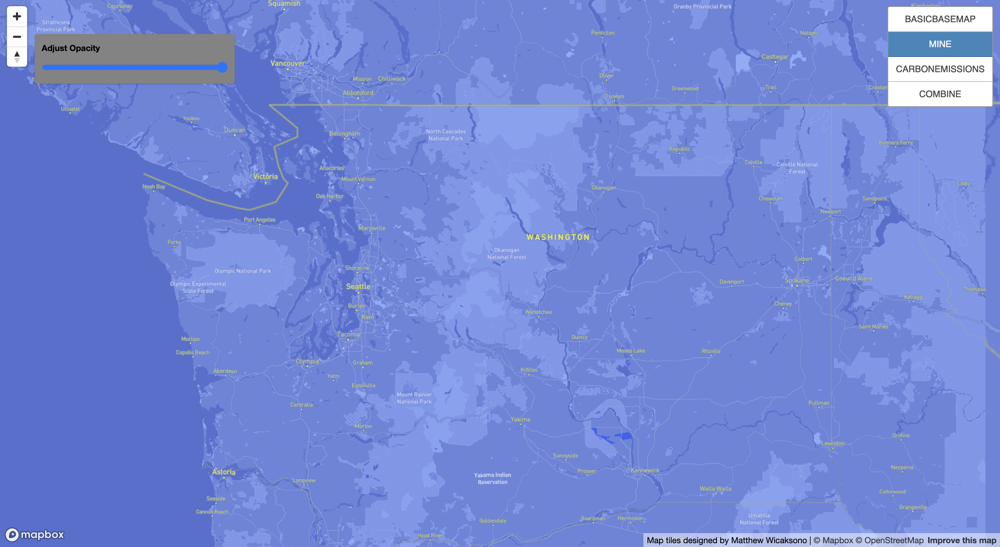
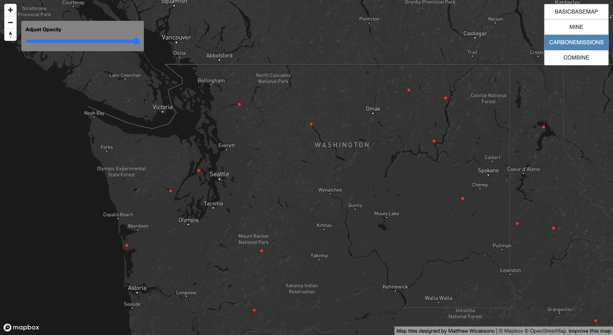
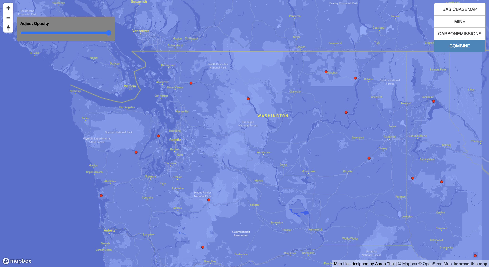

# mapdesigntile

**Introduction**
This file contain lab04 work with the web map url, screenshots of the four layers, and brief descriptions of each tile sets

**Map Overview**
This is [my map URL](http://127.0.0.1:5500/index.html), The map elements are consist of:

- Zoom in and zoom out tool, with a compass
- Opacity tool
- Four tiles which user could click on and off

**Screenshots**

**1. Basic Basemap** 

This map is a basic basemap, specifically by using basic 'Mapbox' style.

**2. Mine Map**

This map's style is modified based on my preference. Starting from the map base, greenspace, and place labels. 

**3. CO2 Emissions**

This map is pointing out 2019 CO2 Emissions in the world and in this case, I'm focusing on Washington. 

**4. Combine Map**

This map is a combination between 'Mine Map' and 'CO2 Emissions'.